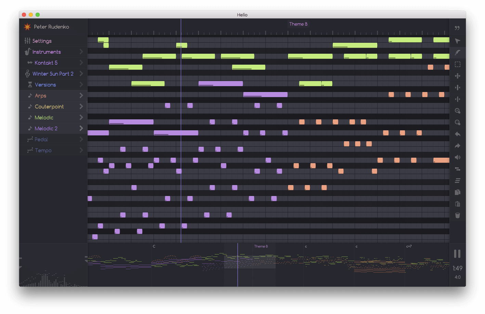

## 
> [Helio Workstation](https://helioworkstation.com) is free and open-source music sequencer, designed to be used on all major platforms.

### Why another sequencer?

Most of the DAW interfaces often seem overcomplicated, and they only tend to get more and more bloated over time. Also most of the DAWs are commercial, proprietary-licensed and almost none of them support all major operating systems at the same time.

Helio aims to be a modern music creation tool, featuring linear-based sequencer with a clean interface, high-performance C++ core, integrated version control providing intelligent synchronization between devices, saved undo history, translations to many languages and more.

### Links

 * Homepage with all latest builds: [https://helioworkstation.com](https://helioworkstation.com/).
 * Project page at [KVR database](http://www.kvraudio.com/product/helio-workstation-by-peter-rudenko).
 * Some [screencasts on Youtube](https://www.youtube.com/channel/UCO3K8iCd1k2FTqSocoE-WXw/).

### Contributing

Helio is a work in progress and still there are many essential features missing, so pull requests are appreciated.

Your ideas are also welcome: friendly and lightweight UI is the main development priority in this project, and if you have a vision on how to improve user experience in music composing, feel free to [share it](https://helioworkstation.com/community/).

You could also [make a new translation](http://helioworkstation.com/translations/) for your native language or improve any of existing translations, which include English, German, French, Italian, Spanish and Russian.

### License

GNU GPL v3 © [Peter Rudenko](https://www.facebook.com/rudenko.peter)

See ``LICENSE`` for more information.

Built-in piano samples are the part of [Salamander Grand Piano by Alexander Holm](https://archive.org/details/SalamanderGrandPianoV3), distributed under [CC-BY license](https://creativecommons.org/licenses/by/3.0/).

Used fonts and icons taken from various free icon fonts (see [Icomoon](https://icomoon.io)) are licensed under [SIL Open Font License](http://scripts.sil.org/cms/scripts/page.php?id=OFL) and [CC-BY](https://creativecommons.org/licenses/by/3.0/).

All Helio logos and translations are also distrubuted under [CC-BY](https://creativecommons.org/licenses/by/3.0/).
