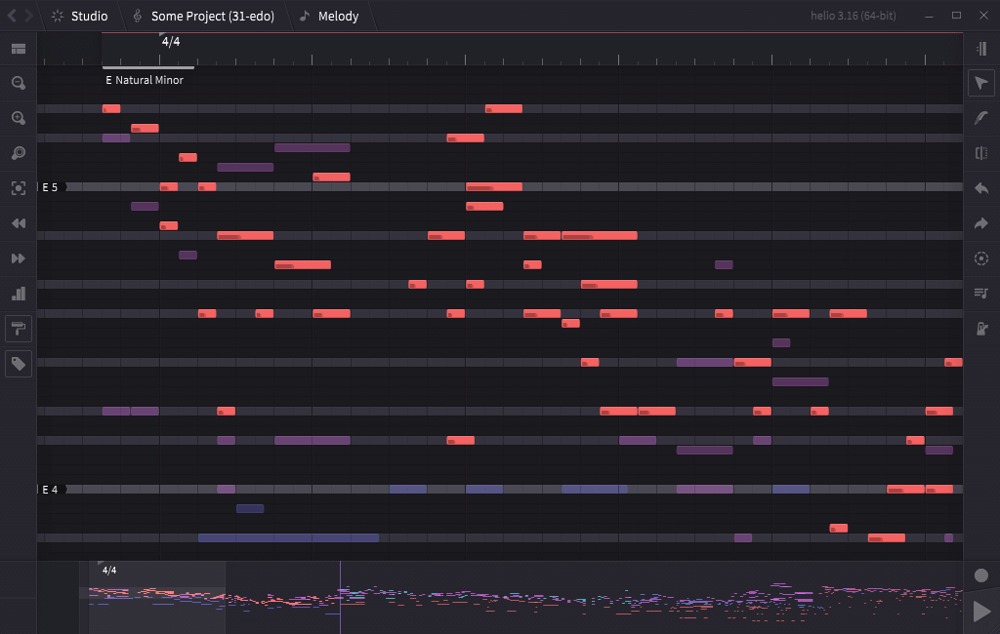
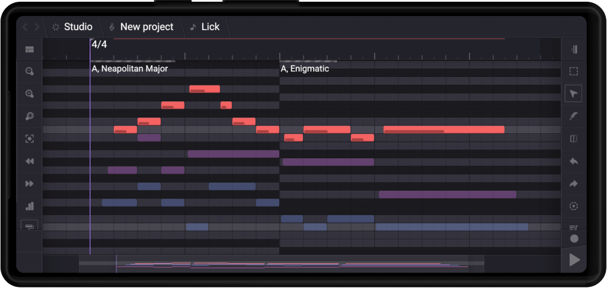
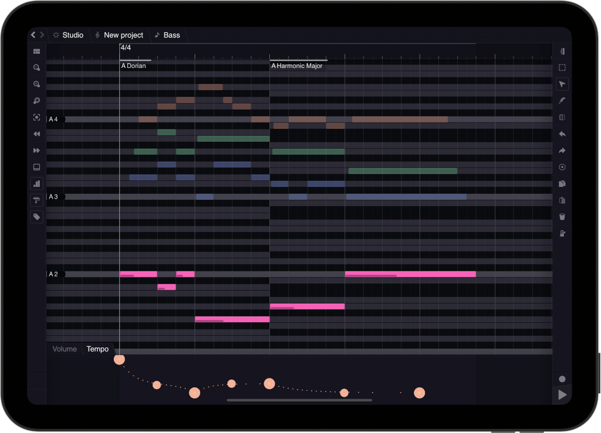

[Helio](https://helio.fm) is a free and open-source music sequencer for desktop and mobile platforms:

## Why another sequencer?

Most of the DAW interfaces often seem [overcomplicated](https://mashable.com/archive/german-u-boat), and they only tend to get more and more bloated over time. Many of them are commercial, proprietary-licensed and almost none of them support all major operating systems at the same time.

Helio is an attempt to rethink a music sequencer to create a tool that **feels right**.

It aims to be a modern music creation software, featuring linear-based/pattern-based sequencer with clean UI, integrated version control, microtonal temperaments support, small portable builds and more; mainly targeted at hobbyist composers, game developers and indie artists. Check out this [YouTube channel](https://www.youtube.com/channel/UCO3K8iCd1k2FTqSocoE-WXw/) for some showcases.

## Getting started

The latest builds can be found at [helio.fm](https://helio.fm).

Check out the documentation to get started: [docs.helio.fm](https://docs.helio.fm).

## Building

[Basic build instructions](Docs/readme.md#building-from-source)

||AppVeyor|Travis CI|
|---|---|---|
|master|||
|develop|||

### Packaging status

## Support the project

* [Become a backer on Patreon](https://www.patreon.com/peterrudenko)
* [Become a backer on OpenCollective](https://opencollective.com/helio-workstation#sponsor)
* [DigitalOcean referral link](https://m.do.co/c/eff5010788f0)

## License and credits

GNU GPL v3 © Peter Rudenko and [contributors](https://github.com/helio-fm/helio-sequencer/graphs/contributors), see ``LICENSE`` for details.

App icon by Valery Davletbaev, distributed under [CC-BY](https://creativecommons.org/licenses/by/4.0/). Other icons from various [free icon fonts](https://icomoon.io) are licensed under [SIL Open Font License](http://scripts.sil.org/cms/scripts/page.php?id=OFL) and [CC-BY](https://creativecommons.org/licenses/by/4.0/).

Built-in [metronome sounds](https://stash.reaper.fm/40824/Metronomes.zip) are recorded by Ludwig Peter Müller, [CC0](https://creativecommons.org/publicdomain/zero/1.0/).

The built-in SoundFont player instument is based on [SFZero](https://github.com/stevefolta/SFZero), written by Steve Folta and [extended](https://github.com/cognitone/SFZeroMT) by Leo Olivers and Cognitone.

All documentation, translations and logotypes are distributed under [CC-BY](https://creativecommons.org/licenses/by/4.0/).

### Translation and proofreading

Afrikaans - Jacques Viviers  
Chinese - Bowen Sun, Yingchun Soul  
German - Aninsi Sasberg  
Greek - Pavlos Mavromatis  
Italian - Claudio Stano, Riccardo Cariboni  
Japanese - Kotone Itaya  
Korean - YoungGwang Jeon, DaYeon Lee, HyoHee Jeon  
Polish - Dawid Bugajski  
Portuguese - Dario Silva, Daniel Leandro  
Vietnamese - Dat T.The  

You can help proofread and improve the translation for your native language [here](https://helio.fm/translations).
